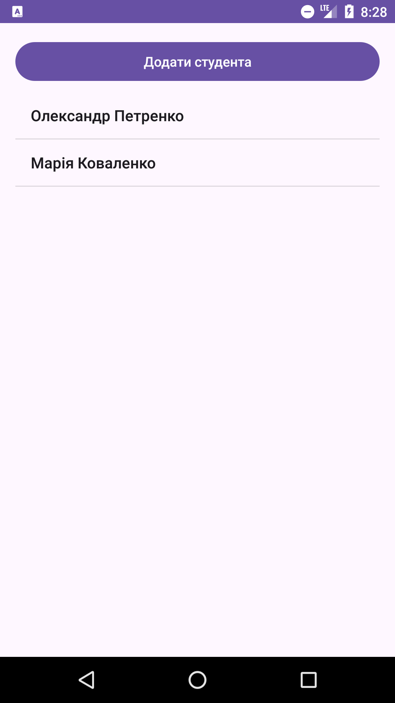
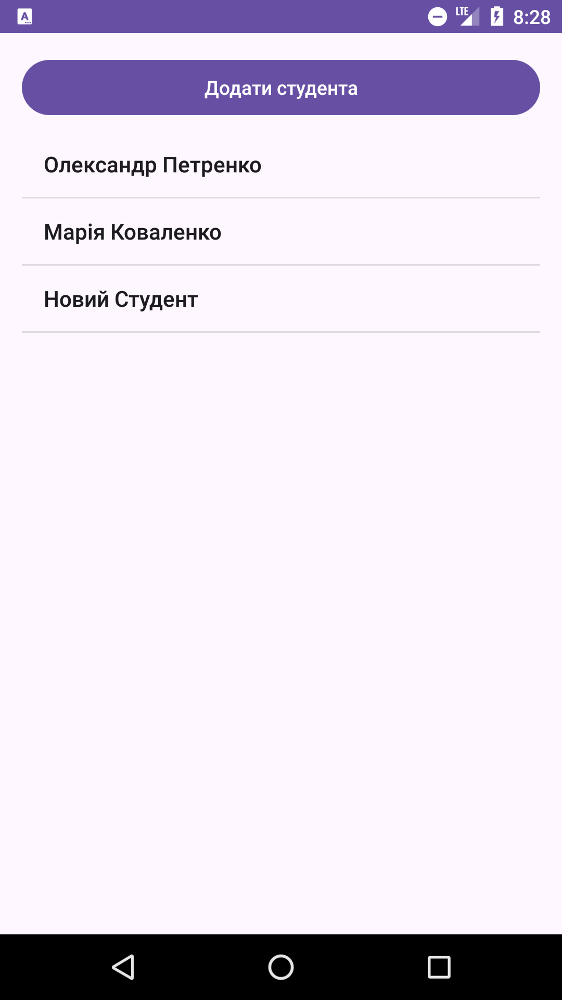
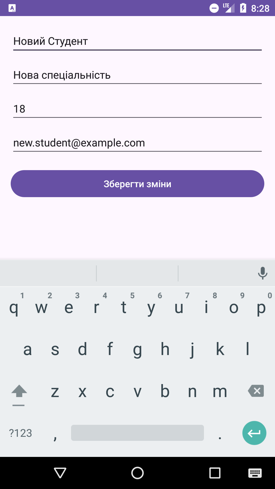
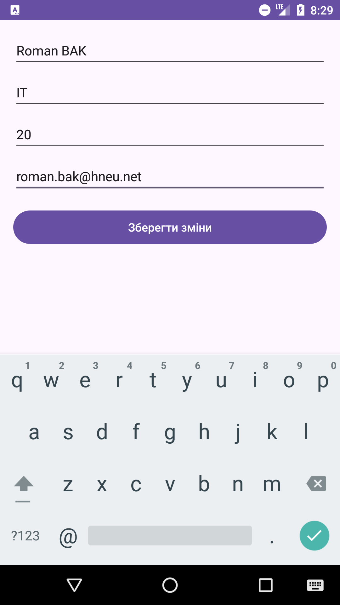
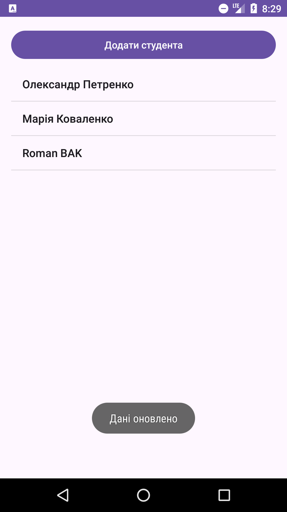

# Звіт по виконаній роботі

## Опис додатку

Цей додаток є простим керівником для студентів університету, який дозволяє додавати нових студентів, переглядати їх деталі та редагувати інформацію. Додаток використовує збереження даних у файлі JSON для зберігання інформації про студентів. Кожен студент має такі дані, як ім'я, спеціальність, вік та електронна пошта. Також кожен студент має аватарку, яка генерується за допомогою ініціалів студента.

## Основні функції

1. **Перегляд студентів**: Користувач може побачити список студентів з їхніми іменами в головному екрані. Список студентів отримується з файлу JSON.

2. **Додавання студента**: За допомогою кнопки "Додати студента" можна створити нового студента з дефолтними даними. Після додавання студент відображатиметься в списку.

3. **Редагування даних студента**: При натисканні на студента в списку відкривається екран редагування, де можна змінити ім'я, спеціальність, вік та електронну пошту. Після збереження змін дані студента оновлюються в JSON файлі.

4. **Аватарка студента**: Для кожного студента генерується аватарка у вигляді кола, всередині якого розміщені ініціали студента. Це дозволяє візуально відрізняти студентів на основі їхніх імен.

5. **Збереження даних**: Дані студентів зберігаються у файлі JSON на пристрої. При додаванні чи редагуванні студента зміни одразу зберігаються у файлі.

## Структура проекту

Проект складається з наступних основних частин:

### 1. **MainActivity**:
- Основний екран, що відображає список студентів у `ListView`.
- Кнопка для додавання нового студента.
- Клік по елементу списку відкриває екран редагування студента.

### 2. **StudentDetailActivity**:
- Екран для редагування даних студента.
- Форма з полями для введення ім'я, спеціальності, віку та email студента.
- Кнопка для збереження змін.

### 3. **Student**:
- Клас моделі для представлення студента з атрибутами: `id`, `name`, `age`, `major`, `email`.

### 4. **StudentRepository**:
- Репозиторій для роботи з даними студентів.
- Завантаження студентів із JSON файлу.
- Збереження змін до JSON файлу.
- Додавання, оновлення студентів.

### 5. **Ресурси**:
- **circular_background.xml**: файл для створення фону у вигляді кола для аватарок студентів.
- Використання `TextView` для відображення імені студента в головному екрані та в деталях студента.

## Використання

1. Запустіть додаток на Android-пристрої або емуляторі.
2. Додайте студента за допомогою кнопки "Додати студента".
3. Перегляньте список студентів, натискаючи на їх імена.
4. Редагуйте дані студента на екрані деталей.
5. Усі зміни будуть збережені в JSON файлі.

## Залежності

- Android SDK: мінімальна версія Android 5.0 (Lollipop)
- Kotlin
- JSON для збереження даних

## Робота додатку

